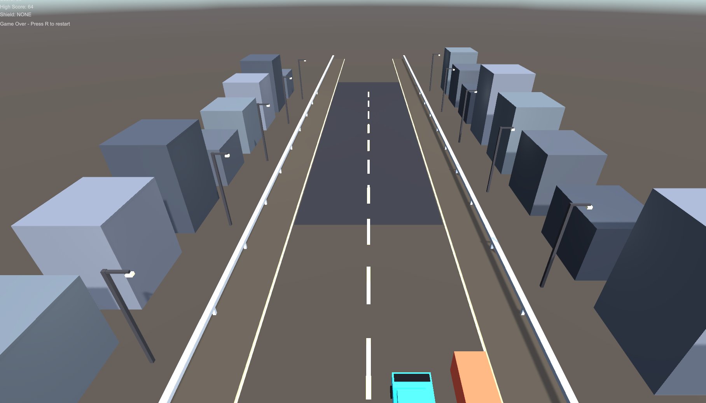
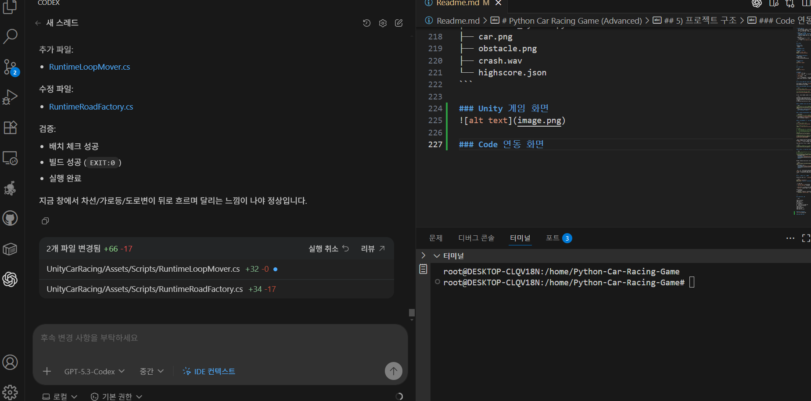

# Python Car Racing Game (Advanced)

Pygame 기반 2D 자동차 레이싱 게임입니다.  
이번 버전에서는 차량 스탯/트랙 테마/적 AI/미션/모바일 입력까지 포함된 고도화 버전으로 업데이트했습니다.

---

## 1) 고도화 기능

- **차량 선택 시스템 (1/2/3 키)**
  - Sprint: 높은 가속, 안정적 핸들링
  - Interceptor: 최고속 특화
  - Drift: 핸들링 특화
  - 각 차량은 **가속/최고속/핸들링** 스탯이 다릅니다.

- **트랙 테마 3종**
  - 도심
  - 사막
  - 야간 네온
  - 라운드 시작 시 랜덤으로 테마가 적용됩니다.

- **적 차량 AI**
  - 다수 적 차량이 등장
  - AI가 주기적으로 **차선 변경**
  - 플레이어 근접 시 **블로킹(플레이어 차선 추적)** 행동 수행

- **미션 시스템**
  - 예: 20초 생존 / 25초 노부스트
  - 성공 시 보너스 점수 획득
  - 노부스트 미션 도중 부스트 사용 시 미션 실패 처리

- **모바일 대응 입력**
  - 화면 하단 **좌/우/부스트 버튼**
  - **스와이프 입력**으로 차선 이동 보조
  - PC에서도 마우스로 동일 UI 테스트 가능

- 기존 기능 유지
  - 실드 아이템(1회 충돌 무효)
  - 부스트 쿨다운
  - 최고 점수 저장(`highscore.json`)

---

## 2) 설치

### 요구사항
- Python 3.10+
- pygame

### 가상환경(권장)

#### macOS / Linux
```bash
python3 -m venv .venv
source .venv/bin/activate
```

#### Windows (PowerShell)
```powershell
python -m venv .venv
.\.venv\Scripts\Activate.ps1
```

### 의존성 설치
```bash
pip install pygame
```

---

## 3) 실행 방법

```bash
python car_race.py
```

### 조작법
- `SPACE`: 게임 시작
- `1 / 2 / 3`: 차량 선택 (시작 화면)
- `← / →`: 이동
- `Left Shift`: 부스트
- `P`: 일시정지
- `Y / N`: 게임오버 후 재시작/종료
- 모바일/터치: 하단 버튼 + 스와이프

---

## 3-1) Unity 기반 실행 방법 (명령어 중심)

Unity 버전으로 실행하려면 `UnityCarRacing`의 C# 스크립트를 Unity 프로젝트에 넣어 실행합니다.

### A. Unity 에디터에서 실행(권장)

```bash
# 1) 저장소 루트로 이동
cd /workspace/Python-Car-Racing-Game

# 2) Unity 전용 안내 문서 확인
cat UnityCarRacing/README_Unity.md
```

그 다음 Unity Hub에서 아래 순서로 실행합니다.

```text
Unity Hub → New Project(2D Core) → 프로젝트 생성
Unity 프로젝트의 Assets/Scripts 폴더에
/workspace/Python-Car-Racing-Game/UnityCarRacing/Assets/Scripts/*.cs 복사
씬 연결 후 Play 버튼(▶)으로 실행
```

### B. macOS에서 Unity CLI로 실행

```bash
# Unity Editor 경로 예시 (버전에 맞게 수정)
/Applications/Unity/Hub/Editor/2022.3.62f1/Unity.app/Contents/MacOS/Unity \
  -projectPath "/path/to/YourUnityProject" \
  -quit -batchmode -logFile -
```

### C. Windows PowerShell에서 Unity CLI로 실행

```powershell
# Unity Editor 경로 예시 (버전에 맞게 수정)
& "C:\Program Files\Unity\Hub\Editor\2022.3.62f1\Editor\Unity.exe" `
  -projectPath "C:\path\to\YourUnityProject" `
  -quit -batchmode -logFile -
```

### D. Linux/WSL에서 이 저장소 기준으로 바로 실행

```bash
# 1) 저장소 루트로 이동
cd /home/Python-Car-Racing-Game

# 2) (최초 1회) 실행 권한
chmod +x scripts/unity/run_unity_game.sh

# 3) 실행
# - 기본 프로젝트 경로: /home/Python-Car-Racing-Game/UnityProject
# - 프로젝트가 없으면 해당 경로로 에디터를 열어 최초 초기화
# - 저장소 C# 스크립트를 프로젝트 Assets/Scripts로 자동 동기화
# - Linux Unity(/opt/unityhub/...) 또는 WSL의 Windows Unity.exe 자동 탐지
scripts/unity/run_unity_game.sh

# 다른 프로젝트를 쓰고 싶으면 경로 지정
scripts/unity/run_unity_game.sh --project "/mnt/c/Users/1/Documents/UnityProjects/MyRacingGame"
```

> WSL + Windows Unity.exe 조합에서는 `--project`를 `/mnt/c/...` 같은 Windows 마운트 경로로 지정해야 합니다.  
> `/home/...` 경로는 Unity에서 프로젝트 생성/빌드가 실패할 수 있습니다.

배치 모드(컴파일 체크)만 하려면:

```bash
# 프로젝트 미초기화 상태면 자동으로 생성 후 컴파일 체크 수행
scripts/unity/run_unity_game.sh --batch-check
```

### E. Unity 빌드 명령 예시 (CI/자동화용)

```bash
# 저장소 포함 BuildScript 사용 (UnityProject/Assets/Editor/BuildScript.cs)
# (Linux Unity 경로/WSL Windows Unity 경로 중 실제 설치 경로로 수정)
"/opt/unityhub/Editor/2022.3.62f1/Editor/Unity" \
  -batchmode -quit \
  -projectPath "/home/Python-Car-Racing-Game/UnityProject" \
  -executeMethod BuildScript.PerformBuild \
  -logFile -
```

WSL에서 Windows Unity.exe를 사용할 때는:

```bash
"/mnt/c/Program Files/Unity/Hub/Editor/2022.3.62f1/Editor/Unity.exe" \
  -batchmode -quit \
  -projectPath "C:\Users\1\Documents\UnityProjects\MyRacingGame" \
  -executeMethod BuildScript.PerformBuild \
  -logFile -
```

> 참고: 이 저장소는 Unity 스크립트 샘플(`UnityCarRacing/Assets/Scripts`)을 제공합니다. 실제 실행/빌드를 위해서는 Unity에서 프로젝트를 생성하고 씬/프리팹/UI 연결을 완료해야 합니다.

---

## 4) 빌드(실행 파일 만들기)

배포용 단일 실행 파일은 `pyinstaller`로 만들 수 있습니다.

```bash
pip install pyinstaller
pyinstaller --onefile --noconsole car_race.py
```

빌드 완료 후:
- `dist/car_race` (Linux/macOS)
- `dist/car_race.exe` (Windows)

> 사운드/이미지 리소스를 함께 배포하려면 PyInstaller spec 또는 `--add-data` 옵션을 추가해 주세요.

예시(Windows):
```powershell
pyinstaller --onefile --noconsole car_race.py --add-data "car.png;." --add-data "obstacle.png;." --add-data "crash.wav;."
```

---

## 5) 프로젝트 구조

```text
.
├── car_race.py
├── config.py
├── core/
│   └── game.py
├── systems/
│   ├── resource_loader.py
│   └── save_system.py
├── car.png
├── obstacle.png
├── crash.wav
└── highscore.json
```

### Unity 게임 화면


### Code 연동 화면
